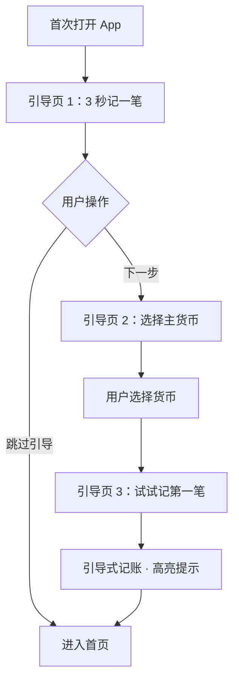

# UX Design Specification ColorFuLedger

**Author:** Wangyang
**Date:** 2026-02-14

---

## Executive Summary

### Project Vision

ColorFuLedger 是一款纯本地离线记账 App，iOS/Android 双平台原生开发。以"3 秒极速记账"为核心体验，完全免费无广告，通过纯离线架构从根本上解决用户隐私顾虑。

**核心 UX 设计原则：**
- **随手记为核心场景** — 碎片化、单笔快速记录，而非批量操作
- **面向低技术素养用户设计** — 以 48 岁中年用户为基准，确保简单直觉
- **小红书式视觉感受** — 清爽、现代、视觉愉悦、操作轻量

### Target Users

- **小林（25 岁，职场人）** — 随手记每笔消费，关注消费结构，想存钱买车
- **陈叔（48 岁，中年人）** — 隐私敏感，晚间统一记录，开支复杂，技术素养低
- **Amy（22 岁，留学生）** — 英文界面，标签分组旅行花费，导出给父母

**设计基准用户：** 陈叔（48 岁）— 如果陈叔能轻松使用，小林和 Amy 也不会有问题。

### Key Design Challenges

1. **3 秒记账的极简流程** — 随手记场景意味着用户可能在走路、排队、饭后，需单手操作、最少步骤、零思考成本
2. **低技术素养用户的直觉设计** — 所有功能必须一眼看懂，避免隐藏操作、手势依赖、多层级嵌套
3. **功能丰富但不复杂** — 13 项 MVP 功能需在简洁界面中有序呈现，不让用户感到"功能太多"

### Design Opportunities

1. **小红书式视觉愉悦感** — 清爽配色、圆角卡片、微动效、舒适间距，让记账变得赏心悦目
2. **智能分类 = 越用越快** — 频繁使用的分类自动排前，用户感受到"App 越来越懂我"，留存的情感锚点
3. **报表"aha 时刻"** — 饼图/折线图触发用户掌控感，视觉设计需让数据一目了然、赏心悦目

## Core User Experience

### Defining Experience

**核心动作：** 记一笔（收入/支出）

**核心流程（< 3 秒）：**
1. 打开 App → 看到今日/本月流水列表
2. 点击"+"按钮 → 进入记账界面
3. 自定义数字键盘输入金额
4. 图标网格选择分类（智能排序，常用在前）
5. 保存 → 返回流水列表，新记录即时出现

**核心循环：** 记录 → 查看流水 → 查看报表 → 发现消费规律 → 持续记录

### Platform Strategy

- **双平台原生：** iOS (Swift) + Android (Kotlin)，各自遵循平台设计规范
- **触控为主：** 单手操作优化，拇指热区布局
- **完全离线：** 零网络依赖，所有功能离线可用
- **iOS:** Human Interface Guidelines，SF Symbols 图标
- **Android:** Material Design 3，Material Icons

### Effortless Interactions

| 交互 | 无摩擦设计 |
|------|----------|
| **记一笔** | "+"按钮在拇指热区（底部居中/右下），一触即达 |
| **输入金额** | 自定义大按钮数字键盘，专为记账优化，支持小数点快捷输入 |
| **选分类** | 图标网格一屏可见 8-12 个，常用分类自动排前，一触选中 |
| **保存** | 选完分类即自动保存（或一键确认），无需额外操作 |
| **查看报表** | 底部 Tab 一键切换，图表即时渲染 |
| **备份** | 系统主动提醒，用户点击即导出，无需理解技术细节 |

### Critical Success Moments

1. **首次记账（10 秒内完成）** — 新手引导结束后完成第一笔记录。失败 = 卸载
2. **第一周的"aha 时刻"** — 打开饼图，看到消费结构。掌控感的起点
3. **智能分类生效** — 用了几天后，常用分类已排到前面，"越用越快"
4. **备份恢复成功** — 换机后导入备份，数据完整还原。信任的关键时刻

### Experience Principles

1. **一眼即懂** — 所有界面、按钮、操作无需解释，48 岁用户看一眼就知道怎么用
2. **触手可及** — 核心操作在拇指热区内，单手即可完成全部记账流程
3. **越用越快** — 智能排序让操作步骤逐步减少，App 适应用户而非用户适应 App
4. **视觉愉悦** — 小红书式清爽美感，让记账变成一种轻松的日常仪式

## Desired Emotional Response

### Primary Emotional Goals

**核心情感：掌控 + 轻松**

| 情感目标 | 描述 |
|---------|------|
| **成就感** | 每次记账完成后，感到"又完成了一件事"，积累小小的日常成就 |
| **从容自信** | 查看报表时，"一切尽在掌握"的确定感，对自己的财务状况心中有数 |
| **温暖安心** | 出错时不慌张，App 像朋友一样温和引导，而非冷冰冰的警告 |

### Emotional Journey Mapping

| 阶段 | 触发场景 | 目标情感 |
|------|---------|--------|
| **初次发现** | App Store 下载页 | 好奇 + 信任（"免费无广告，试试看"） |
| **首次打开** | 新手引导 | 轻松 + 期待（"好简单，我能行"） |
| **首次记账** | 完成第一笔 | 成就感（"搞定了！比想象的简单"） |
| **日常使用** | 每次记一笔 | 轻松的满足感（"又记了一笔，好习惯"） |
| **查看报表** | 打开饼图/折线图 | 从容自信（"我的钱花得清清楚楚"） |
| **遇到错误** | 误删/恢复失败 | 安心（"没事，App 在引导我"） |
| **备份恢复** | 换机后数据还原 | 信赖（"数据在我手上，稳稳的"） |
| **长期使用** | 3 个月后 | 归属感（"这就是我的记账工具"） |

### Micro-Emotions

**强化的正面微情感：**
- **自信** — 每个操作都有清晰反馈，用户始终知道发生了什么
- **成就** — 记账完成的微动效/视觉反馈，强化"完成了"的感觉
- **发现** — 报表中偶尔的洞察（如"本月餐饮占比最高"），激发持续使用
- **信赖** — 备份提醒、恢复成功，传递"你的数据很安全"

**避免的负面微情感：**
- ❌ **困惑** — 任何界面不应让用户停下来思考"这是什么"
- ❌ **焦虑** — 操作错误不应引发恐慌，而是温和引导修复
- ❌ **挫败** — 流程不应让用户觉得"我不会用"
- ❌ **被监视感** — 虽然记录财务数据，但绝不能让用户感到被审视

### Design Implications

| 情感目标 | UX 设计策略 |
|---------|----------|
| **成就感** | 记账保存后轻微动效（如 ✓ 弹出 + 卡片滑入列表），给予正向反馈 |
| **从容自信** | 报表配色沉稳清爽，数据呈现清晰有序，关键数字突出但不刺眼 |
| **温暖友好** | 错误提示用友善语气（"确定删除这条记录吗？删除后无法恢复哦"），避免"警告！"式措辞 |
| **轻松** | 界面留白充足，操作节奏舒缓，不堆砌信息 |
| **信赖** | 备份提醒语气亲切（"你已经记了 50 笔账啦！建议备份一下，以防万一"） |

### Emotional Design Principles

1. **每次记账都是小成就** — 通过微动效和视觉反馈，让用户感到"又完成了一件事"，而非"又做了一个无聊的操作"
2. **数据呈现传递自信** — 报表设计让用户感到"我清楚我的财务状况"，而非"天哦我花了这么多"
3. **错误是温暖的对话** — 所有异常场景用友善、引导式语言处理，App 是用户的朋友而非审判者
4. **安静的可靠** — 备份、数据保护等安全功能安静工作在后台，用户不需要担心，但需要时总能找到

## UX Pattern Analysis & Inspiration

### Inspiring Products Analysis

#### 小红书（风格与视觉参考）

| 维度 | 分析 |
|------|------|
| **核心 UX 优势** | 视觉愉悦感极强 — 圆角卡片、舒适间距、柔和配色、轻量微动效 |
| **导航模式** | 底部 Tab 导航（5 个 Tab），中间突出的"+"发布按钮 |
| **信息层级** | 卡片式布局，信息密度适中不拥挤，留白充裕 |
| **交互特点** | 操作轻量、反馈即时，点赞/收藏有微动效确认 |
| **配色策略** | 白色主背景，红色为品牌色点缀，整体清爽明亮 |
| **字体策略** | 标题粗体突出，正文轻量舒适，层级分明 |

#### 鲨鱼记账（功能与流程参考）

| 维度 | 分析 |
|------|------|
| **核心 UX 优势** | 记账流程极简 — 打开即记账，数字键盘 + 分类图标网格 |
| **记账流程** | 金额键盘常驻底部，分类图标网格在上方，选完即保存 |
| **分类展示** | 圆形图标网格，4 列布局，一屏 8-12 个，支持滑动翻页 |
| **数字键盘** | 自定义大按钮键盘，带小数点和退格，专为金额输入优化 |
| **首页设计** | 今日收支汇总 + 最近记录列表 |
| **报表设计** | 简洁的饼图和折线图，配色柔和 |

### Transferable UX Patterns

**从小红书借鉴：**

| 模式 | 应用到 ColorFuLedger |
|------|----------------|
| **底部 Tab + 中央突出"+"按钮** | 主导航采用底部 Tab，"+"记账按钮居中突出，品牌色高亮 |
| **圆角卡片布局** | 流水列表每条记录用圆角卡片呈现，视觉柔和 |
| **微动效反馈** | 记账保存后的 ✓ 动效、卡片滑入动画，强化成就感 |
| **留白与间距** | 充裕的行间距和边距，不拥挤，呼吸感强 |
| **柔和配色** | 白色主背景 + 品牌色点缀，清爽不刺眼 |

**从鲨鱼记账借鉴：**

| 模式 | 应用到 ColorFuLedger |
|------|----------------|
| **自定义数字键盘** | 大按钮、专为金额优化、带小数点快捷键 |
| **分类图标网格** | 圆形图标 + 文字标签，4 列布局，一屏可见 |
| **选分类即保存** | 减少步骤，选完分类自动保存（或单击确认） |
| **今日汇总 + 流水列表** | 首页顶部显示今日/本月收支汇总，下方为流水列表 |

### Anti-Patterns to Avoid

| 反模式 | 来源 | 为什么避免 |
|--------|------|----------|
| **广告插入** | 鲨鱼记账免费版 | 破坏信任和沉浸感，ColorFuLedger 完全无广告 |
| **功能入口过多** | 部分记账 App 首页塞满入口 | 让低技术素养用户困惑，违反"一眼即懂"原则 |
| **强制注册/登录** | 多数 App | 增加首次使用门槛，ColorFuLedger 零注册直接使用 |
| **深层嵌套导航** | 部分工具类 App | 48 岁用户容易迷路，保持扁平导航（≤ 2 层） |
| **过度动效** | 部分设计感过强的 App | 影响效率，与"3 秒记账"冲突，动效应克制精准 |
| **冷冰冰的错误提示** | 传统工具 App | 与"温暖友好"情感原则冲突 |

### Design Inspiration Strategy

**采纳（直接借鉴）：**
- 小红书的底部 Tab + 中央突出"+"按钮导航模式
- 鲨鱼记账的自定义数字键盘 + 分类图标网格记账流程
- 小红书的圆角卡片 + 留白 + 柔和配色视觉风格

**适配（修改后使用）：**
- 鲨鱼记账的"选分类即保存"→ 增加轻量确认动效（强化成就感）
- 小红书的微动效 → 简化为记账场景的精准反馈（不过度）
- 鲨鱼记账的首页布局 → 增加更强的视觉层级和呼吸感

**避免：**
- 任何广告或推广内容
- 功能入口堆砌（首页保持极简）
- 深层嵌套导航（最多 2 层）
- 过度装饰性动效（效率优先）

## Design System Foundation

### Design System Choice

**方案：iOS 主导的统一设计系统 + 自定义主题层**

以 iOS (SwiftUI/UIKit) 为设计主导平台，Android 端在 Jetpack Compose/XML 中复刻 iOS 的视觉风格，实现双端高度视觉统一。在原生基础上叠加 ColorFuLedger 自定义主题层。

### Rationale for Selection

| 决策因素 | 选择理由 |
|---------|--------|
| **视觉统一** | 以 iOS HIG 风格为基准，Android 端复刻同样的视觉语言，用户在两端看到几乎一致的界面 |
| **品牌一致性** | 统一的配色、圆角、间距、字体策略，确保 ColorFuLedger 品牌感跨平台一致 |
| **iOS 优先** | iOS 用户对视觉品质要求更高，以 iOS 为主导确保最佳体验 |
| **开发效率** | 一套设计稿适用两端，减少设计和沟通成本 |
| **可访问性** | 各平台仍使用原生组件渲染，保留 VoiceOver/TalkBack 原生支持 |

### Implementation Approach

**iOS 端（主导平台）：**
- SwiftUI 为主，UIKit 补充
- SF Symbols 作为图标库
- 自定义 Design Tokens 控制主题

**Android 端（视觉跟随）：**
- Jetpack Compose 为主
- 自定义图标集，视觉对齐 SF Symbols 风格
- 复刻 iOS 端的圆角、间距、配色、动效

**跨平台统一项：**

| 统一项 | 规范 |
|--------|------|
| **配色** | 同一套品牌色板（主色、辅色、语义色） |
| **圆角** | 统一圆角半径（卡片 12pt，按钮 8pt，输入框 8pt） |
| **间距** | 统一间距系统（4pt 基准，8/12/16/24/32pt 梯度） |
| **字体层级** | 统一视觉层级（标题/正文/辅助文字大小比例一致） |
| **图标风格** | 统一线性图标风格，iOS 用 SF Symbols，Android 用匹配风格的自定义图标 |
| **动效** | 统一动效时长和曲线（保存确认 300ms ease-out，页面切换 250ms） |

**允许的平台差异：**

| 差异项 | iOS | Android |
|--------|-----|--------|
| **状态栏** | iOS 原生状态栏 | Android 原生状态栏 |
| **导航手势** | iOS 边缘滑动返回 | Android 系统返回手势 |
| **字体** | SF Pro | Roboto（但大小比例统一） |
| **系统弹窗** | UIAlertController | AlertDialog |
| **文件选择器** | UIDocumentPickerViewController | SAF DocumentProvider |

### Customization Strategy

**ColorFuLedger 自定义主题层（叠加在原生之上）：**

1. **Design Tokens 系统** — 定义一套跨平台的设计变量（颜色、间距、圆角、字号），两端各自实现
2. **自定义组件** — 记账数字键盘、分类图标网格、流水卡片等核心组件双端统一设计
3. **小红书式视觉** — 充裕留白、圆角卡片、柔和配色、克制微动效
4. **主题扩展预留** — Design Tokens 架构支持后续切换主题（深色模式、精品主题等）

## Defining Core Experience

### Defining Experience

**ColorFuLedger 的核心标签：** *"3 秒记一笔"*

用户会这样向朋友介绍：*"打开 App，输个数字，点个图标，搞定。3 秒不到。"*

这个交互是 ColorFuLedger 的灵魂。如果这个体验做到极致，其他一切（报表、备份、标签）都是锦上添花。

### User Mental Model

**用户的心智模型：** 记账 = 写一张小纸条

| 心智模型 | 设计映射 |
|---------|--------|
| "我花了多少钱" | 数字键盘（底部，大按钮） |
| "花在什么上" | 分类图标网格（上方，一目了然） |
| "记下来了" | 保存动效 ✓（即时反馈） |
| "备注一下" | 可选备注输入（不强制，不阻断流程） |

**现有方案的痛点 → ColorFuLedger 的解法：**
- 随手记：广告打断 → ColorFuLedger 零广告零干扰
- Excel：步骤繁琐 → ColorFuLedger 3 步搞定
- 鲨鱼记账：体验好但有广告 → ColorFuLedger 同等流畅 + 完全免费

### Success Criteria

| 成功指标 | 标准 |
|---------|------|
| **操作时长** | 从点击"+"到保存完成 < 3 秒 |
| **操作步骤** | ≤ 3 步（输金额 → 选分类 → 保存） |
| **认知负担** | 48 岁用户首次使用无需思考"下一步做什么" |
| **错误容忍** | 输错金额可直接退格修改，选错分类可重新点选 |
| **完成感** | 保存后有明确的视觉反馈（✓ 动效 + 卡片滑入） |

### Novel UX Patterns

**模式分析：** 纯粹使用成熟模式，零创新风险

ColorFuLedger 的记账交互不需要发明新模式。鲨鱼记账已经验证了"数字键盘 + 分类网格"的有效性。差异化不在交互创新，而在品质执行：

| 维度 | 策略 |
|------|------|
| **交互模式** | 成熟模式 — 数字键盘 + 图标网格（鲨鱼记账验证） |
| **差异化点** | 视觉品质（小红书级）+ 智能排序 + 零广告 |
| **学习成本** | 零 — 用过任何记账 App 或计算器的人都会用 |

### Experience Mechanics

**记账界面布局：**

```
┌─────────────────────────────┐
│  ← 返回        支出 | 收入    │  ← 收支切换 Tab
│                             │
│  ¥ 25.00                    │  ← 金额显示区
│  备注（选填）                  │  ← 备注输入（轻触展开）
│                             │
│  ┌─ 分类图标网格 ─────┐     │
│  │ 🍜餐饮  🛒购物  🚗交通  🏠住房│  ← 4列布局
│  │ 📱通讯  🎮娱乐  👔服饰  🏥医疗│  ← 智能排序
│  │ 📚教育  ✈️旅行  👶育儿  ➕更多│  ← 可翻页
│  └───────────────────────┘  │
│                             │
│  ┌─ 自定义数字键盘 ───┐   │
│  │  [1]  [2]  [3]  [⌫]   │  ← 大按钮
│  │  [4]  [5]  [6]  [+/-] │  ← 收入/支出切换
│  │  [7]  [8]  [9]  [完成] │  ← 完成按钮
│  │  [标签] [0]  [.]       │  ← 标签快捷入口
│  └─────────────────────┘  │
└─────────────────────────────┘
```

**流程步骤：**

| 步骤 | 用户操作 | 系统响应 |
|------|---------|--------|
| **1. 启动** | 点击底部"+"按钮 | 记账界面从底部滑入，键盘就绪，光标在金额区 |
| **2. 输入金额** | 数字键盘输入金额 | 金额实时显示，支持退格修改 |
| **3. 选分类** | 点击分类图标 | 图标高亮 → ✓ 动效 → 自动保存 → 界面滑出回到流水列表 |
| **（可选）备注** | 输入金额后点击备注区 | 展开文字输入框，输入后点分类保存 |
| **（可选）标签** | 点击键盘左下角标签按钮 | 弹出标签选择，选完回到记账界面 |

**关键设计细节：**
- 默认为"支出"模式（用户 90% 场景是记支出）
- 选完分类即自动保存 + ✓ 动效，无需额外确认按钮
- 备注和标签为可选操作，不阻断核心 3 步流程
- 键盘"完成"按钮用于：输完金额但不选分类时手动保存（使用上次分类）

## Visual Design Foundation

### Color System

**品牌主色：珊瑚橙** — 温暖、活力、年轻，呼应小红书式的视觉愉悦感

| 角色 | 色值 | 用途 |
|------|------|------|
| **主色 Primary** | `#FF6B6B` 珊瑚橙 | "+"按钮、Tab 高亮、品牌标识 |
| **主色深 Primary Dark** | `#E55A5A` | 按钮按压态、强调文字 |
| **主色浅 Primary Light** | `#FFE8E8` | 选中背景、轻量高亮 |
| **辅色 Secondary** | `#4ECDC4` 薄荷绿 | 收入标识、正面趋势、成功状态 |
| **背景色 Background** | `#FAFAFA` 极浅灰 | 主背景，柔和不刺眼 |
| **卡片色 Surface** | `#FFFFFF` 纯白 | 卡片、弹窗、输入区域 |
| **文字主色 Text Primary** | `#2D3436` 深灰黑 | 主要文字、金额数字 |
| **文字次色 Text Secondary** | `#636E72` 中灰 | 辅助文字、备注、时间戳 |
| **文字弱色 Text Tertiary** | `#B2BEC3` 浅灰 | 占位符、禁用态 |
| **分割线 Divider** | `#F0F0F0` | 列表分割、区域边界 |

**语义色：**

| 语义 | 色值 | 用途 |
|------|------|------|
| **支出** | `#FF6B6B` 珊瑚橙（主色） | 支出金额、支出图标 |
| **收入** | `#4ECDC4` 薄荷绿（辅色） | 收入金额、收入图标 |
| **成功** | `#00B894` 翡翠绿 | 保存成功 ✓、备份完成 |
| **警告** | `#FDCB6E` 琥珀黄 | 备份提醒、存储不足 |
| **错误** | `#E17055` 柔橙红 | 输入错误、恢复失败（温暖而非刺眼） |

**对比度合规：** 所有文字色与背景色的对比度 ≥ 4.5:1（WCAG AA 标准）

### Typography System

**字体策略：** iOS 主导，双端比例统一

| 平台 | 字体 |
|------|------|
| **iOS** | SF Pro（系统默认） |
| **Android** | Roboto（系统默认） |

**字体层级（Type Scale）：**

| 层级 | 大小 | 字重 | 用途 |
|------|------|------|------|
| **Display** | 32pt | Bold | 月度总额、首页汇总数字 |
| **Title 1** | 24pt | Semibold | 页面标题（报表、设置） |
| **Title 2** | 20pt | Semibold | 卡片标题、分组标题 |
| **Body Large** | 17pt | Regular | 流水列表金额 |
| **Body** | 15pt | Regular | 正文、分类名称 |
| **Caption** | 13pt | Regular | 时间戳、备注、辅助信息 |
| **Small** | 11pt | Regular | 角标、极小辅助文字 |

**金额数字特殊处理：**
- 金额使用等宽数字（Tabular Figures），确保对齐
- 记账键盘数字：28pt Bold，大而清晰
- 支出用主色（珊瑚橙），收入用辅色（薄荷绿）

### Spacing & Layout Foundation

**间距系统：** 4pt 基准，舒展留白

| Token | 值 | 用途 |
|-------|-----|------|
| `space-xs` | 4pt | 图标与文字间距 |
| `space-sm` | 8pt | 紧凑元素间距 |
| `space-md` | 12pt | 列表项内部间距 |
| `space-lg` | 16pt | 卡片内边距、区域间距 |
| `space-xl` | 24pt | 卡片间距、区块间距 |
| `space-2xl` | 32pt | 页面顶部/底部留白 |
| `space-3xl` | 48pt | 大区块分隔 |

**圆角系统：**

| Token | 值 | 用途 |
|-------|-----|------|
| `radius-sm` | 8pt | 按钮、输入框、小标签 |
| `radius-md` | 12pt | 流水卡片、分类图标背景 |
| `radius-lg` | 16pt | 弹窗、底部弹出面板 |
| `radius-xl` | 24pt | 记账面板、大卡片 |
| `radius-full` | 50% | "+"按钮、头像、圆形图标 |

**布局原则（舒展留白）：**
- 卡片间距 ≥ 16pt，区块间距 ≥ 24pt
- 屏幕水平边距 ≥ 20pt
- 列表项高度 ≥ 56pt（确保拇指点击舒适）
- 内容区域不超过屏幕宽度的 90%，两侧留白
- 一屏信息量控制在 5-7 条记录，不拥挤

### Accessibility Considerations

| 维度 | 规范 |
|------|------|
| **对比度** | 文字/背景对比度 ≥ 4.5:1（WCAG AA） |
| **点击区域** | 最小 44x44pt (iOS) / 48x48dp (Android) |
| **动态字体** | 支持系统级字体缩放（iOS Dynamic Type / Android SP） |
| **语义标签** | 所有交互元素提供无障碍标签（VoiceOver / TalkBack） |
| **色彩无障碍** | 不仅依赖颜色传递信息，同时使用图标/文字辅助 |
| **动效** | 尊重系统"减少动态效果"设置，可降级为无动效 |

## Design Direction Decision

### Design Directions Explored

通过 HTML 可视化展示了 6 个核心页面的设计方向（见 `ux-design-directions.html`）：

| 页面 | 方向 | 评价 |
|------|------|------|
| **首页 A（温暖清爽）** | 渐变汇总卡片 + 圆角流水列表 | ✅ 选定 — 温暖活力，小红书感 |
| **首页 B（极简纯净）** | 纯白无渐变，排版留白 | 备选 — 高级但偏冷 |
| **记账界面** | 分类网格 + 数字键盘 | ✅ 确认 |
| **报表页** | 饼图 + 趋势柱状图 | ✅ 确认 |
| **新手引导** | 3 步简洁引导 | ✅ 确认 |
| **设置页** | iOS 风格分组列表 | ✅ 确认 |

### Chosen Direction

**方向 A：温暖清爽**

- 首页采用珊瑚橙渐变汇总卡片，传递温暖活力
- 流水列表使用圆角白色卡片，舒展留白
- 底部 Tab 导航，"+"按钮居中突出
- 所有页面风格统一：圆角 + 留白 + 柔和配色

### Icon Strategy

**图标方案：Ant Design Icons**

- **不使用 Emoji** — 确保跨平台视觉一致性，避免 Emoji 在不同设备上渲染差异
- **iOS 端：** 使用 Ant Design 风格的自定义 SVG 图标（线性风格）
- **Android 端：** 同一套 Ant Design SVG 图标
- **图标风格统一：** 线宽 1.5px，圆角端点，与圆角卡片风格呼应

**Ant Design 图标映射（记账分类）：**

| 分类 | Ant Design 图标 | 背景色 |
|------|----------------|--------|
| 餐饮 | CoffeeOutlined | `#FFE8E8` |
| 购物 | ShoppingCartOutlined | `#F3E8FF` |
| 交通 | CarOutlined | `#FFF3E0` |
| 住房 | HomeOutlined | `#E8F4FD` |
| 通讯 | MobileOutlined | `#E8FAF8` |
| 娱乐 | PlayCircleOutlined | `#FFF8E1` |
| 服饰 | SkinOutlined | `#FCE4EC` |
| 医疗 | MedicineBoxOutlined | `#E8F5E9` |
| 教育 | ReadOutlined | `#E3F2FD` |
| 旅行 | GlobalOutlined | `#FFF3E0` |
| 育儿 | SmileOutlined | `#F3E8FF` |

**导航图标映射：**

| Tab | Ant Design 图标 |
|-----|----------------|
| 明细 | UnorderedListOutlined |
| 报表 | PieChartOutlined |
| 标签 | TagOutlined |
| 设置 | SettingOutlined |
| 记账"+" | PlusOutlined |

### Design Rationale

1. **温暖清爽 > 极简纯净** — 更贴合小红书式的视觉愉悦感和"成就感"情感目标
2. **渐变卡片** — 首页汇总数字配合珊瑚橙渐变，视觉焦点明确，传递品牌感
3. **Ant Design 图标** — 跨平台一致性强，线性风格与圆角卡片设计语言统一，专业且现代
4. **舒展留白** — 每个页面都保持充裕间距，48 岁用户看着舒服不累

## User Journey Flows

### 旅程 1：极速记账（核心路径）

**场景：** 小林午饭后随手记一笔

```mermaid
flowchart TD
    A[首页 · 流水列表] -->|点击 "+" 按钮| B[记账界面滑入]
    B --> C[数字键盘输入金额]
    C --> D{需要备注？}
    D -->|否| E[点击分类图标]
    D -->|是| F[点击备注区输入] --> E
    E --> G{需要标签？}
    G -->|否| H[✓ 动效 · 自动保存]
    G -->|是| I[点击标签按钮 · 选择标签] --> J[点击分类图标] --> H
    H --> K[界面滑出 · 回到流水列表]
    K --> L[新记录出现在列表顶部]
```

**关键交互细节：**

| 步骤 | 时间 | 交互 | 反馈 |
|------|------|------|------|
| 点击"+" | 0s | 底部居中按钮 | 记账界面从底部滑入（250ms） |
| 输入金额 | 0-1.5s | 自定义数字键盘 | 金额实时显示，大字体 |
| 选分类 | 1.5-2.5s | 点击图标网格 | 图标高亮 + ✓ 动效 |
| 自动保存 | 2.5-3s | 无需操作 | 界面滑出，新记录滑入列表 |

**边缘场景：**
- 输错金额 → 退格键修改
- 选错分类 → 重新点击正确分类（覆盖选择）
- 中途放弃 → 点击"返回"或下滑关闭，不保存

### 旅程 2：新手引导（首次使用）

**场景：** 小王首次下载打开 ColorFuLedger



**关键交互细节：**

| 步骤 | 设计 | 情感 |
|------|------|------|
| 引导页 1 | Ant Design 图标动画 + "3 秒记一笔"标题 | 好奇 + 轻松 |
| 引导页 2 | 货币列表选择，默认根据系统 Locale 推荐 | 自信（"系统懂我"） |
| 引导页 3 | 半透明遮罩 + 高亮记账按钮区域 | 成就感（"我做到了！"） |
| 跳过 | 底部"跳过引导"文字按钮，不显眼但可触达 | 自主掌控 |

### 旅程 3：备份与恢复

**场景：** 陈叔备份数据 / 小李换机恢复

**备份流程：**

```mermaid
flowchart TD
    A1[设置页] --> B1[备份与恢复]
    B1 --> C1[点击"导出备份"]
    C1 --> D1[系统文件选择器 · 选择保存位置]
    D1 --> E1[导出进度条]
    E1 --> F1[✓ 备份成功 · 显示文件大小和位置]
```

**恢复流程：**

```mermaid
flowchart TD
    A2[设置页] --> B2[备份与恢复]
    B2 --> C2[点击"导入恢复"]
    C2 --> D2[警告提示：导入将覆盖现有数据]
    D2 -->|确定| E2[系统文件选择器 · 选择备份文件]
    D2 -->|取消| B2
    E2 --> F2[校验文件完整性]
    F2 -->|校验通过| G2[导入进度条]
    F2 -->|校验失败| H2[友善提示：请选择正确的备份文件]
    G2 --> I2[✓ 恢复成功 · 显示恢复记录数量]
```

**提示语气（温暖友好）：**

| 场景 | 提示内容 |
|------|--------|
| 首次备份提醒 | "你已经记了 50 笔账啦！建议备份一下，以防万一" |
| 备份成功 | "备份完成！共 2,156 条记录，文件已保存到你选择的位置" |
| 恢复确认 | "导入备份会覆盖现有数据哦，确定继续吗？" |
| 恢复成功 | "恢复成功！共找回 2,156 条记录，一条不少 ✓" |
| 文件校验失败 | "这个文件好像不是 ColorFuLedger 的备份文件，请重新选择" |

### 旅程 4：报表查看（aha 时刻）

**场景：** 小林连续记账一周后打开报表

```mermaid
flowchart TD
    A[底部 Tab 点击"报表"] --> B[报表页 · 默认本月]
    B --> C[月度汇总卡片 · 总收入/总支出/结余]
    C --> D[饼图 · 按分类占比]
    D --> E{用户操作}
    E -->|点击饼图扇区| F[高亮该分类 · 显示金额和占比]
    E -->|左右滑动月份| G[切换月份 · 图表更新]
    E -->|向下滚动| H[趋势折线图 · 近 6 月]
    H --> I[标签柱状图 · 按标签汇总]
```

**关键交互细节：**

| 元素 | 设计 | 情感目标 |
|------|------|--------|
| 月度汇总 | 大字体数字，收支用语义色区分 | 从容自信 |
| 饼图 | 柔和配色，点击扇区展开详情 | 发现感 |
| 趋势图 | 折线图带数据点，支出下降显示绿色箭头 | 掌控感 |
| 时间切换 | 左右箭头 + 月份文字，简单直觉 | 一眼即懂 |

### 旅程 5：标签筛选与 CSV 导出

**场景：** Amy 按标签筛选旅行花费并导出给父母

```mermaid
flowchart TD
    A[底部 Tab 点击"标签"] --> B[标签列表页]
    B --> C[点击"Paris Weekend"标签]
    C --> D[该标签下所有记录 · 按时间排序]
    D --> E[顶部显示该标签汇总金额]
    E --> F{用户操作}
    F -->|查看详情| G[点击某条记录 · 查看/编辑]
    F -->|导出| H[点击右上角"导出"按钮]
    H --> I[导出设置 · 选择字段和顺序]
    I --> J[生成 CSV 文件]
    J --> K[系统分享面板 · 邮件/微信/文件]
```

### Journey Patterns

**跨旅程的通用交互模式：**

| 模式 | 说明 | 应用场景 |
|------|------|--------|
| **底部滑入面板** | 内容面板从底部滑入，下滑或点返回关闭 | 记账界面、筛选面板、导出设置 |
| **即时反馈** | 操作后立即给予视觉/动效确认 | 保存 ✓、删除确认、备份完成 |
| **温暖提示** | 友善语气的弹窗，提供明确选项 | 备份提醒、删除确认、恢复警告 |
| **渐进展开** | 默认简洁，点击展开更多 | 备注输入、标签选择、报表详情 |
| **语义色区分** | 珊瑚橙=支出，薄荷绿=收入 | 所有涉及收支的界面 |

### Flow Optimization Principles

1. **最短路径优先** — 核心操作（记账）≤ 3 步，不强制可选步骤
2. **默认值智能** — 默认支出模式、默认本月报表、默认系统 Locale 货币
3. **可逆操作** — 输错可退格、选错可重选、删除需确认
4. **渐进复杂度** — 基础功能一目了然，进阶功能（标签、导出）按需展开
5. **一致的退出方式** — 所有面板都支持"返回"按钮和下滑手势关闭

## Component Strategy

### Design System Components

基于"iOS 主导 + 自定义主题层"设计系统，以下组件直接使用原生平台组件：

| 基础组件 | iOS (SwiftUI) | Android (Compose) | 用途 |
|---------|---------------|-------------------|------|
| **导航栏** | NavigationStack | TopAppBar | 页面标题、返回 |
| **底部 Tab** | TabView | NavigationBar | 主导航 |
| **列表** | List / LazyVStack | LazyColumn | 流水列表、设置列表 |
| **弹窗** | Alert | AlertDialog | 确认/警告（基础场景） |
| **进度条** | ProgressView | LinearProgressIndicator | 备份导出 |
| **开关** | Toggle | Switch | 设置项 |
| **文字输入** | TextField | OutlinedTextField | 备注、搜索 |
| **日期选择器** | DatePicker | DatePickerDialog | 报表筛选 |

### Custom Components

以下组件需要自定义设计，原生组件无法满足 ColorFuLedger 的品牌和交互需求：

#### AmountKeypad — 记账数字键盘

- **目的：** 专为金额输入优化的大按钮数字键盘
- **内容：** 0-9 数字、小数点、退格、完成按钮、标签快捷入口
- **布局：** 4 列 4 行网格，按钮高度 ≥ 52pt
- **状态：** 默认态、按压态（背景加深 10%）、禁用态（小数点已输入时灰显）
- **交互：** 点击触觉反馈（Haptic），金额实时显示在上方显示区
- **无障碍：** 每个按键有 accessibilityLabel，支持 VoiceOver 读出数字

#### CategoryGrid — 分类图标网格

- **目的：** 一屏展示 8-12 个分类，一触选中
- **内容：** Ant Design SVG 图标 + 分类名称 + 彩色圆形背景
- **布局：** 4 列网格，每行间距 16pt，图标 40pt + 文字 13pt
- **状态：** 默认态、选中态（缩放 + 边框高亮）、编辑态（长按进入自定义排序）
- **变体：** 支出分类（默认显示）、收入分类（切换 Tab 后显示）
- **智能排序：** 根据使用频率自动将常用分类排前
- **交互：** 点击选中 → ✓ 动效 → 触发保存；支持翻页滑动查看更多分类
- **无障碍：** 图标 + 文字组合的 accessibilityLabel（如"餐饮分类"）

#### SummaryCard — 首页汇总卡片

- **目的：** 首页顶部展示收支汇总，传递掌控感
- **内容：** 本月总支出（大字体）、总收入、结余；当前月份
- **布局：** 圆角 24pt 卡片，内边距 20pt，珊瑚橙渐变背景（`#FF6B6B` → `#FF8E8E`）
- **状态：** 默认态；加载态（数字 shimmer 占位）
- **文字色：** 白色（在渐变背景上）
- **交互：** 点击可展开月度对比（可选增强）
- **无障碍：** "本月支出 2500 元，收入 8000 元，结余 5500 元"

#### TransactionCard — 流水记录卡片

- **目的：** 流水列表中每条记录的展示
- **内容：** 分类图标 + 分类名称 + 备注 + 金额 + 时间
- **布局：** 圆角 12pt 白色卡片，高度 ≥ 64pt，左侧图标 → 中间文字 → 右侧金额
- **状态：** 默认态、按压态（背景 `#F8F8F8`）
- **金额色：** 支出珊瑚橙、收入薄荷绿
- **交互：** 点击 → 进入全屏详情页；左滑 → 显示删除按钮
- **无障碍：** "餐饮，25 元，备注午餐，今天 12:30"

#### TransactionDetail — 记录详情页

- **目的：** 全屏展示单条记录完整信息，支持编辑和删除
- **内容：** 分类图标（大）、金额（Display 字号）、分类名、备注、标签、日期时间
- **布局：** 全屏页面，顶部大图标 + 金额，下方信息列表（iOS 风格分组）
- **操作：** 编辑按钮（导航栏右上角）→ 进入编辑模式；底部删除按钮（红色文字）
- **编辑模式：** 金额可重新输入、分类可重选、备注可修改、标签可增删
- **状态：** 查看态、编辑态
- **交互：** 编辑 → 保存/取消；删除 → 温暖确认弹窗（"确定删除这条记录吗？删除后无法恢复哦"）
- **无障碍：** 页面标题"记录详情"，所有字段有语义标签

#### FloatingAddButton — 记账"+"浮动按钮

- **目的：** 底部 Tab 中央的记账入口，一触即达
- **内容：** PlusOutlined 图标，白色图标 + 珊瑚橙背景
- **布局：** 56pt 圆形，居中突出于 Tab 栏上方
- **状态：** 默认态、按压态（缩放 0.95 + 颜色加深）
- **交互：** 点击 → 记账界面从底部滑入
- **无障碍：** "记一笔"

#### PieChart — 饼图组件

- **目的：** 报表页按分类展示支出占比
- **内容：** 分类占比扇区 + 中心总金额 + 图例
- **布局：** 环形饼图，中心留空显示总额
- **配色：** 每个分类使用其对应的背景色（加深版）
- **交互：** 点击扇区 → 高亮 + 弹出该分类金额和占比
- **无障碍：** "饼图，餐饮占 35%，1250 元"

#### TrendLineChart — 趋势折线图

- **目的：** 展示近 6 个月收支趋势
- **内容：** 支出折线（珊瑚橙）、收入折线（薄荷绿）、月份标签
- **布局：** 横向铺满，高度 200pt，带数据点圆点
- **交互：** 长按数据点 → 显示该月具体数值
- **无障碍：** "趋势图，1 月支出 3000 元，2 月支出 2800 元"

#### TagSelector — 标签选择器

- **目的：** 记账时快捷选择/创建标签
- **内容：** 已有标签列表（胶囊按钮）+ 新建标签入口
- **布局：** 底部弹出面板，标签横向流式布局，可多选
- **状态：** 未选中（描边）、选中（填充品牌色 + 白色文字）
- **交互：** 点击切换选中；长按快捷编辑标签名；点击"+"新建
- **无障碍：** "标签选择器，已选中巴黎周末"

#### OnboardingOverlay — 新手引导遮罩

- **目的：** 首次使用时引导用户完成第一笔记账
- **内容：** 半透明黑色遮罩 + 高亮区域（圆角裁剪）+ 引导文字 + 下一步按钮
- **布局：** 全屏覆盖，高亮区域与目标元素对齐
- **状态：** 步骤 1/2/3 依次推进
- **交互：** 点击"下一步"或点击高亮区域推进；底部"跳过"文字按钮
- **无障碍：** "引导步骤 1，点击加号按钮开始记账"

#### FriendlyDialog — 温暖提示弹窗

- **目的：** 替代系统冷冰冰的 Alert，传递温暖友好语气
- **内容：** 标题 + 友善描述文字 + 操作按钮（确认/取消）
- **布局：** 圆角 16pt 卡片居中，按钮并排底部
- **变体：** 信息提示（单按钮）、确认操作（双按钮）、危险操作（删除，确认按钮为柔橙红）
- **交互：** 点击按钮或点击遮罩关闭
- **无障碍：** 弹窗出现时 VoiceOver 聚焦到标题

### Component Implementation Strategy

**实现原则：**

1. **Design Tokens 驱动** — 所有自定义组件使用统一的 Design Tokens（颜色、间距、圆角、字号），确保跨平台视觉一致
2. **原生渲染** — 自定义组件基于原生 UI 框架构建（SwiftUI / Jetpack Compose），保留平台性能和无障碍支持
3. **组合优先** — 复杂组件由基础组件组合而成（如 TransactionDetail = NavigationBar + SummaryCard + List）
4. **状态驱动** — 所有组件采用声明式状态管理，状态变化驱动 UI 更新

**双端一致性策略：**

| 维度 | 策略 |
|------|------|
| **视觉** | 同一套 Design Tokens，两端各自实现，确保配色/间距/圆角一致 |
| **交互** | 核心交互一致（点击、滑动），平台手势差异允许（iOS 边缘滑动返回 vs Android 系统返回） |
| **图标** | 同一套 Ant Design SVG 图标资源，两端共享 |
| **动效** | 同一套时长和曲线参数，各端原生动画 API 实现 |

### Implementation Roadmap

**Phase 1 — 核心组件（MVP 必须）：**

| 组件 | 优先级 | 关键流程 |
|------|--------|---------|
| AmountKeypad | P0 | 极速记账 |
| CategoryGrid | P0 | 极速记账 |
| SummaryCard | P0 | 首页展示 |
| TransactionCard | P0 | 首页流水列表 |
| FloatingAddButton | P0 | 全局记账入口 |
| FriendlyDialog | P0 | 全局交互反馈 |

**Phase 2 — 支撑组件：**

| 组件 | 优先级 | 关键流程 |
|------|--------|---------|
| TransactionDetail | P1 | 查看/编辑记录 |
| PieChart | P1 | 报表页 |
| TrendLineChart | P1 | 报表页 |
| TagSelector | P1 | 标签功能 |

**Phase 3 — 增强组件：**

| 组件 | 优先级 | 关键流程 |
|------|--------|---------|
| OnboardingOverlay | P1 | 新手引导 |
| BarChart（标签柱状图） | P2 | 报表增强 |
| ExportSettingsPanel | P2 | CSV 导出 |

## UX Consistency Patterns

### Button Hierarchy

| 层级 | 样式 | 用途 | 示例 |
|------|------|------|------|
| **主按钮 Primary** | 珊瑚橙填充 + 白色文字，圆角 8pt，高度 48pt | 核心操作，每个页面最多 1 个 | "完成"、"保存"、"导出备份" |
| **次按钮 Secondary** | 白色填充 + 珊瑚橙描边 + 珊瑚橙文字 | 次要操作 | "取消"、"编辑" |
| **文字按钮 Text** | 无背景，珊瑚橙文字 | 轻量操作 | "跳过引导"、"查看更多" |
| **危险按钮 Danger** | 白色填充 + 柔橙红文字 | 破坏性操作 | "删除记录" |
| **浮动按钮 FAB** | 珊瑚橙圆形 + 白色图标，56pt | 全局核心入口 | "+"记账按钮 |

**按钮状态：**
- 默认态 → 按压态（背景加深 10%，缩放 0.98）→ 禁用态（透明度 40%）
- 所有按钮点击区域 ≥ 44x44pt

### Feedback Patterns

| 场景 | 反馈方式 | 时长 | 示例 |
|------|---------|------|------|
| **操作成功** | ✓ 动效 + 轻微 Haptic | 300ms | 记账保存成功 |
| **操作失败** | FriendlyDialog + 引导修复 | 持续至用户操作 | 备份文件校验失败 |
| **警告确认** | FriendlyDialog 双按钮 | 持续至用户选择 | 删除记录确认 |
| **信息提示** | Toast 浮层（底部上方） | 2s 自动消失 | "已复制到剪贴板" |
| **加载中** | Shimmer 骨架屏 | 持续至加载完成 | 首页数据加载 |
| **空状态** | 居中插图 + 引导文字 + 操作按钮 | 持续 | "还没有记录，点击 + 开始记账" |

**反馈语气原则（温暖友好）：**
- ✅ "备份完成！共 2,156 条记录，一条不少"
- ✅ "确定删除这条记录吗？删除后无法恢复哦"
- ❌ "错误：文件格式不正确"
- ❌ "警告：此操作不可撤销"

### Form Patterns

| 模式 | 规范 |
|------|------|
| **输入框** | 圆角 8pt，高度 44pt，左侧 16pt 内边距，占位符用 Text Tertiary 色 |
| **实时校验** | 输入时不校验，失焦或提交时校验；错误状态：底部红色提示文字 |
| **金额输入** | 专用 AmountKeypad 组件，不使用系统键盘 |
| **搜索输入** | 顶部搜索栏，左侧搜索图标，右侧清除按钮（有内容时显示） |
| **备注输入** | 单行文字输入，轻触展开，无强制校验 |
| **标签选择** | 胶囊式多选，横向流式布局 |
| **货币选择** | iOS 风格选择列表，单选 |

**表单错误处理：**
- 错误文字在输入框下方，13pt，柔橙红色（`#E17055`）
- 输入框边框变为柔橙红色
- 修正后错误自动消失

### Navigation Patterns

| 模式 | 规范 | 应用场景 |
|------|------|--------|
| **底部 Tab** | 4 个 Tab + 中央"+"按钮，图标 + 文字标签 | 全局主导航 |
| **页面推入** | 从右侧推入（iOS 标准），导航栏显示返回按钮 | 详情页、子页面 |
| **底部滑入** | 面板从底部滑入，支持下滑关闭 | 记账界面、标签选择、导出设置 |
| **全屏覆盖** | 全屏模态，导航栏显示"关闭"或"取消" | 新手引导 |

**导航深度规则：**
- 最多 2 层嵌套（首页 → 详情页）
- 底部 Tab 在所有一级页面可见
- 所有非一级页面提供明确的返回路径

### List & Card Patterns

| 模式 | 规范 |
|------|------|
| **流水列表** | 按日期分组，组标题为日期 + 当日小计；卡片间距 8pt |
| **设置列表** | iOS 风格分组列表，圆角 12pt 分组背景，分组间距 24pt |
| **卡片按压** | 背景色变为 `#F8F8F8`，200ms 过渡 |
| **左滑操作** | 流水卡片左滑露出红色删除按钮，滑动距离 80pt |
| **下拉刷新** | 不需要（纯离线，无网络数据） |
| **空列表** | 居中友好插图 + 引导文字 + 主按钮 |

### Animation Patterns

| 动效 | 时长 | 曲线 | 场景 |
|------|------|------|------|
| **页面推入/推出** | 250ms | ease-in-out | 页面导航 |
| **底部面板滑入** | 300ms | ease-out | 记账界面、选择器 |
| **保存成功 ✓** | 300ms | spring(0.6) | 记账保存 |
| **卡片滑入列表** | 200ms | ease-out | 新记录出现 |
| **按钮按压** | 100ms | ease-out | 所有按钮 |
| **饼图扇区展开** | 200ms | ease-out | 报表交互 |

**动效原则：**
- 尊重系统"减少动态效果"设置 → 降级为无动效
- 功能性动效优先（指示方向、确认操作），装饰性动效克制
- 总时长不超过 300ms，不拖慢用户操作节奏

### Color Application Patterns

| 模式 | 规范 |
|------|------|
| **支出金额** | 珊瑚橙 `#FF6B6B`，Body Large 字号 |
| **收入金额** | 薄荷绿 `#4ECDC4`，Body Large 字号，前缀"+" |
| **主操作元素** | 珊瑚橙填充（按钮、Tab 高亮、FAB） |
| **选中状态** | 珊瑚橙描边或浅珊瑚背景 `#FFE8E8` |
| **分割线** | `#F0F0F0`，0.5pt 粗细 |
| **页面背景** | `#FAFAFA` 极浅灰 |
| **卡片背景** | `#FFFFFF` 纯白 |

### Design System Integration Rules

1. **Token 优先** — 所有样式值通过 Design Tokens 引用，禁止硬编码色值/间距
2. **组件复用** — 相同功能场景使用同一组件，禁止重复造轮子
3. **平台适配** — 核心视觉一致，平台特有交互（手势、系统弹窗）遵循各自规范
4. **可扩展** — 模式规范支持后续新增页面和功能，保持一致性

## Responsive Design & Accessibility

### Responsive Strategy

ColorFuLedger 为原生移动 App（非 Web），"响应式"指不同屏幕尺寸的适配。

**iOS 设备适配：**

| 设备类别 | 屏幕宽度 | 适配策略 |
|---------|---------|---------|
| **iPhone SE / Mini** | 375pt | 基准布局，分类网格 4 列，键盘按钮紧凑模式 |
| **iPhone 标准** | 390-393pt | 标准布局，分类网格 4 列，舒展间距 |
| **iPhone Plus / Max** | 428-430pt | 扩展布局，分类网格可显示更多行，卡片间距加大 |
| **iPad（未来）** | 744-1024pt | 暂不支持，后续可扩展为分栏布局 |

**Android 设备适配：**

| 设备类别 | 屏幕宽度 | 适配策略 |
|---------|---------|---------|
| **小屏** | < 360dp | 紧凑模式，间距缩小，字号保持不变 |
| **标准** | 360-411dp | 基准布局 |
| **大屏** | 412dp+ | 扩展布局，增加间距 |

**适配原则：**
- Auto Layout (iOS) / ConstraintLayout (Android) 弹性布局
- 核心组件按比例缩放，不固定像素
- 金额显示使用 `minimumScaleFactor`，超长金额自动缩小
- 流水卡片宽度 = 屏幕宽度 - 40pt 边距
- 分类图标 40pt 固定，列间距弹性分配
- 尊重 Safe Area（刘海/灵动岛/Home Indicator）

### Accessibility Strategy

**合规等级：WCAG AA**

| 维度 | 规范 | 实现方式 |
|------|------|--------|
| **对比度** | 文字/背景 ≥ 4.5:1，大文字 ≥ 3:1 | 设计阶段校验所有色彩组合 |
| **点击区域** | iOS ≥ 44x44pt，Android ≥ 48x48dp | 所有可交互元素最小尺寸 |
| **动态字体** | 支持系统字体缩放 | iOS Dynamic Type / Android SP |
| **屏幕阅读器** | VoiceOver / TalkBack 全覆盖 | 所有元素提供 accessibilityLabel |
| **色彩无障碍** | 不单独依赖颜色传递信息 | 收支用颜色 + 正负号 + 图标区分 |
| **减少动效** | 尊重系统设置 | 降级为无动效模式 |

**各组件无障碍标签：**

| 组件 | VoiceOver / TalkBack 标签 |
|------|--------------------------|
| FloatingAddButton | "记一笔，按钮" |
| AmountKeypad 按键 | "数字1" / "退格" / "完成" / "小数点" |
| CategoryGrid 项 | "餐饮分类，按钮" → 选中后 "已选中，餐饮分类" |
| TransactionCard | "餐饮，25元，午餐，今天12:30" |
| SummaryCard | "本月支出2500元，收入8000元，结余5500元" |
| PieChart 扇区 | "餐饮占35%，1250元" |
| FriendlyDialog | 弹出时焦点移至标题，读出完整内容 |

### Testing Strategy

**设备测试矩阵：**

| 平台 | 测试设备 | 覆盖场景 |
|------|---------|---------|
| **iOS** | iPhone SE 3 (375pt) | 小屏适配 |
| **iOS** | iPhone 15 (393pt) | 标准布局 |
| **iOS** | iPhone 15 Pro Max (430pt) | 大屏布局 |
| **Android** | Pixel 7 (412dp) | 标准 Android |
| **Android** | Samsung Galaxy A14 (360dp) | 小屏 Android |
| **Android** | Samsung Galaxy S24 Ultra (412dp) | 大屏 Android |

**无障碍测试：**
- VoiceOver 全流程测试（iOS）：记账、查看报表、备份恢复
- TalkBack 全流程测试（Android）：同上
- 动态字体：最大字号下界面不溢出、不截断
- 减少动效模式：所有动效正确降级
- 色觉模拟：红绿色盲模式下收支仍可区分

### Implementation Guidelines

**iOS 开发：**
- 使用 SwiftUI `.dynamicTypeSize()` 支持动态字体
- 使用 `.accessibilityLabel()` 和 `.accessibilityHint()` 标注所有元素
- 使用 `@Environment(\.reduceMotion)` 检测减少动效设置
- 布局使用 GeometryReader 适配不同屏幕尺寸

**Android 开发：**
- 使用 `sp` 单位确保字体跟随系统缩放
- 使用 `contentDescription` 标注所有元素
- 使用 `ViewCompat.setAccessibilityDelegate()` 自定义无障碍行为
- 检测 `Settings.Global.ANIMATOR_DURATION_SCALE` 适配减少动效
